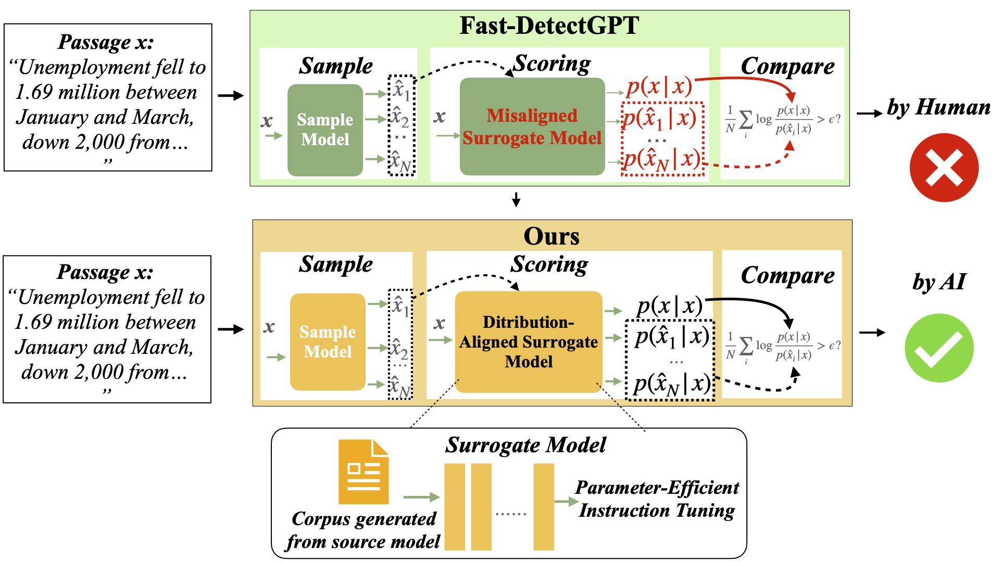

# DALD: Improving Logits-based Detector without Logits from Black-box LLMs

This repository contains the official code and resources for the paper [DALD](https://arxiv.org/abs/2406.05232), where we borrow or extend some code from [Fast-DetectGPT](https://github.com/baoguangsheng/fast-detect-gpt).
> **DALD: Improving Logits-based Detector without Logits from Black-box LLMs** 
> Presented at the 38th Conference on Neural Information Processing Systems (NeurIPS 2024).

## Overview



## Getting Started

```bash
git clone https://github.com/cong-bzeng/DALD.git
cd DALD
conda create --name dald python=3.10
conda activate dald
pip install -r requirements.txt
```

## Workspace
- Main experiment: named by exp_targetsourcemodel
    - ./exp_claude3opus-20240229 
    - ./exp_gpt3.5turbo0301
    - ./exp_gpt4-0613
    
    Each folder contains the data generated by source model and original human-written data for evaluation. We upload these data for reproduce our result conviently. You can generating your own testing data using ./scripts/data_builder.py following the [Fast-DetectGPT](https://github.com/baoguangsheng/fast-detect-gpt)

## Train Surrogate model
Before training surrogate model, specify the following args in [train.sh](./train.sh):
- dataset_name: the dataset used to SFT surrogate model
- target_model_name: the model name to be detected
- scoring_model_name: surrogate model to be trained
- output_model_dir: location to save the trained model

Run the following command to train a surrogate model
```bash
sh train.sh
```
Please make sure the model names are added in full model list in [model.py](./scripts/model.py)

## Evaluate 
Before evaluating the performance of detection on target models, make sure there exist corresponding test data folder. Run the following command to evaluate the performance of the trained model.
```bash
sh eval.sh
```


## Citation
If you find this work useful, you can cite it with the following BibTex entry:

```bibtex
@article{zeng2024improving,
  title={Improving Logits-based Detector without Logits from Black-box LLMs},
  author={Zeng, Cong and Tang, Shengkun and Yang, Xianjun and Chen, Yuanzhou and Sun, Yiyou and Li, Yao and Chen, Haifeng and Cheng, Wei and Xu, Dongkuan and others},
  journal={arXiv preprint arXiv:2406.05232},
  year={2024}
}
